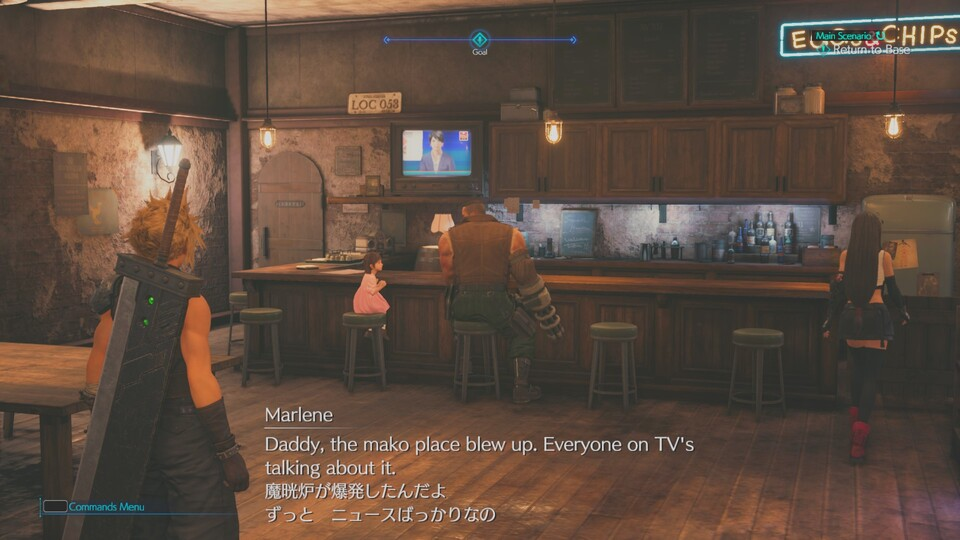

# FF7R Text Mod Tools ver 1.3.4
Text modding tools for FF7R (Final Fantasy VII Remake)<br>




There are 6 functions in my tools.

- Make dualsub mod: Merges subtitle data between 2 languages.
- Make swapsub mod: Swaps subtitle data between 2 languages.
- Resize subtitle box: Resizes subtitle wedget.
- .uexp to .json: Exports text data as .json.
- .json to .uexp: Swaps text data with .json.
- .uexp to .txt: Exports text data as .txt.


## Make Dualsub Mod
`make_dualsub_mod.exe` is a tool for merging subtitle data.<br>
You can make a mod to display 2 languages in the game.<br>
<br>
I made [dualsub mod](https://www.nexusmods.com/finalfantasy7remake/mods/57) by this tool.<br>

### Usage

```
make_dualsub_mod.exe pak_dir lang1 lang2 [options]
```
- pak_dir: where unpacked files are (e.g. D:\quickbms\pakchunk0_s24-WindowsNoEditor)
- lang1: a language you want to display
- lang2: another language you want to display
- --mod_name= : specifies mod name
- --just_swap: swaps subtitles instead of merging them
- --save_as_json: not only makes mod files, but also exports as json
- --save_as_txt: not only makes mod files, but also exports as txt
- --all: moddifies all text (not only subtitle, but also command, menu, etc.) 

If you run `make_dualsub_mod.exe`, a mod folder (like `.\dualsub_mod_US_JP`) will be generated .
## Make Swapsub Mod
If you run `make_dualsub_mod.exe` with `--just_swap` otption, subtitle data will be swapped between 2 languages.

## Resize subtitle box
`resize_subtitle_box.exe` is a tool for resizeing subtitle wedget.
### Usage
```
resize_subtitle_box.exe uexp [options]
```
- uexp: where `Subtitle00.uexp` is (e.g. `D:\quickbms\pakchunk0_s22-WindowsNoEditor\Menu\Resident\Cinema\Subtitle00.uexp`)
- --width= : width of subtitle wedget
- --height= : height of subtitle wedget

e.g. width=930, height=500<br>

<br>
If you run `resize_subtitle_box.exe`, `new_Subtitle00.uexp` will be generated .

## .uexp to .json
`uexp_to_json.exe` is a tool for exporting text data as .json.<br>
This tool can use for only text data (`End\Content\GameContents\Text\*\*.uexp`).<br>
Also, the output json files will not be compatible with other tools<br>
### Usage

```
uexp_to_json.exe uexp --mode="uexp2json" [options]
```
- uexp: uexp file (e.g. `D:\quickbms\pakchunk0_s24-WindowsNoEditor\End\Content\GameContents\Text\US\010-MAKO1_TxtRes.uexp`)
- --mode="uexp2json"
- --out_dir= : output folder

## .json to .uexp
If you run `uexp_to_json.exe` with `--mode="json2uexp"` option, text data will be replaced with .json.<br>

### Usage

```
uexp_to_json.exe uexp --mode="json2uexp" --json=json [options]
```
- uexp: uexp file (e.g. `D:\quickbms\pakchunk0_s24-WindowsNoEditor\End\Content\GameContents\Text\US\010-MAKO1_TxtRes.uexp`)
- --mode="json2uexp"
- --json=: json file (e.g. `.\json\010-MAKO1_TxtRes.json`)
- --out_dir= : output folder

## .uexp to .txt
If you run `uexp_to_json.exe` with `--mode="uexp2txt"` option, text data will be exported as .txt like [this](https://github.com/matyalatte/FF7R_text_mod_tools/wiki/Dialog-Test-Data%3F).<br>

### Usage

```
uexp_to_json.exe uexp --mode="uexp2txt" [options]
```
- uexp: uexp file (e.g. `D:\quickbms\pakchunk0_s24-WindowsNoEditor\End\Content\GameContents\Text\US\010-MAKO1_TxtRes.uexp`)
- --mode="uexp2txt"
- --out_dir= : output folder


## Tips on Text Modding
I posted some tips (format specification, text decoration, etc.) here.<br>
[Home · matyalatte/FF7R_text_mod_tools Wiki](https://github.com/matyalatte/FF7R_text_mod_tools/wiki)
